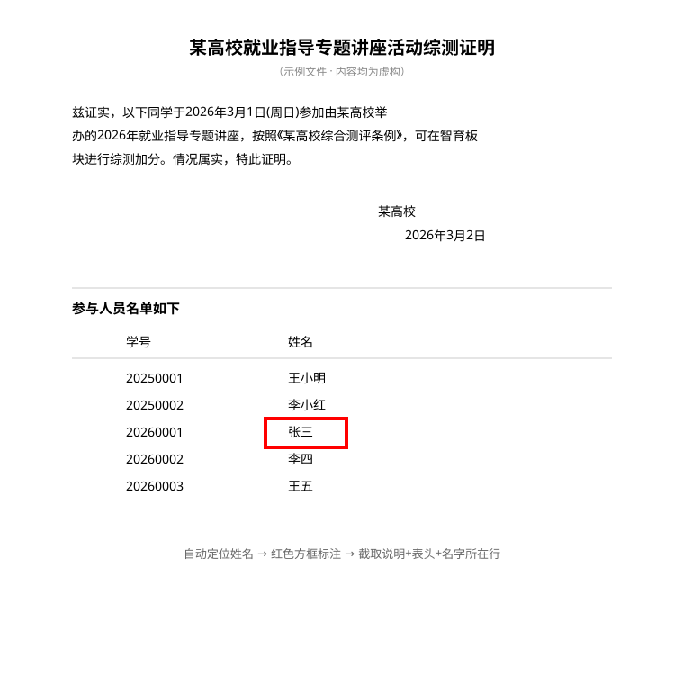

# pdf-name-boxer

> 综测证明整理工具：从评分细则到最终 Word 的完整流程。上传一堆证明 PDF，自动分类加分、定位姓名页码、红框图名、检测公章、生成 Word（可选填评测表）。



*示例为完全虚构数据（XX大学 / 张三 / 20260001），仅用于演示红框效果。*

## 功能

- **分类加分**：读评分细则 + 板块评定 Excel，判定每个活动的板块（德育/智育/美育/劳育）、分数、小项编号，与用户确认后再继续
- **自动定位姓名页码**（`locate_name.py`）：逐页 OCR 搜索姓名（可选学号双条件匹配防同名），找不到自动升级 zoom 重试
- **红框图名**（`box_names.py`）：自动定位姓名画红框，截取"说明 + 公章 + 名单表头 + 名字所在行"生成 Word
- **公章检测**（`check_stamp.py`）：检测说明页是否含红色公章，避免交付缺章的证明
- **评测表填写**（可选）：按板块写入加分项，汇总行留空给测评小组

## 快速开始

```bash
pip install pymupdf pillow python-docx rapidocr-onnxruntime numpy openpyxl

# 0.（可选）生成完全虚构的示例材料，体验完整流程
python examples/make_demo.py

# 1. 自动定位姓名所在页码（建议配学号防同名）
python scripts/locate_name.py <你的PDF目录> --name 张三 --id 20260001 --out locate_result.json

# 2. 检查说明页是否有公章
python scripts/check_stamp.py <你的PDF目录>/某证明.pdf --page 1

# 3. 复制 examples/config.example.json 为 config.json 并填写，生成 Word
python scripts/box_names.py config.json
```

> 注意：`examples/` 下的示例均为**虚构数据**，直接替换成你自己的材料即可。

## 使用流程

读评分细则 → 读证明 → 分类判定（智育/德育/美育/劳育）→ 与用户确认 → 询问姓名并自动定位 → 查公章 → 截图 → 生成 Word →（可选）填评测表。

完整执行规则见 [SKILL.md](SKILL.md)。

## 隐私安全

- 姓名/学号只写入本地 `config.json` 和输出文件，临时截图运行后自动删除
- 控制台日志学号脱敏（只显示前 4 位）
- **不会从文件名推断用户姓名**，始终向用户口头确认
- 本仓库所有示例均为虚构数据，不含任何真实个人信息

## 许可证

[MIT](LICENSE) © AJAZ666
